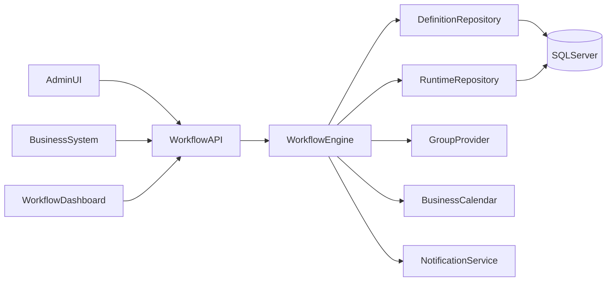
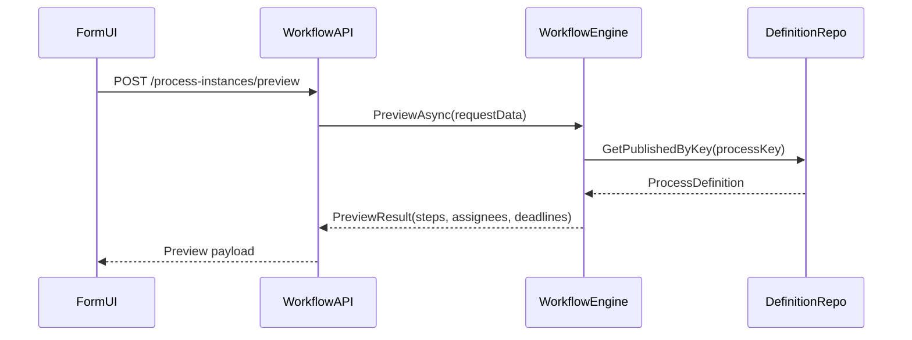

# Architecture Overview

This document describes the MVP architecture of the approval workflow framework.

## High-level structure

## Layer responsibilities

- `Workflow.Abstractions`: canonical domain contracts and DTOs shared by all layers.
- `Workflow.Engine`: orchestration and workflow state transitions.
- `Workflow.Persistence.EFCore`: SQL Server-specific adapters behind repository interfaces.
- `Workflow.Framework`: host extension layer with one-line setup, auto-migration, and dashboard routes.
- `Workflow.Api`: external REST interface for definition/runtime operations.
- `Workflow.Admin`: minimal administrator-facing entry points.
- `Workflow.Integration.VacationDemo`: sample host integration.

## Runtime sequence

## State and synchronization

The engine includes explicit concurrency controls:

- `lock` per process instance while applying step transitions.
- `SemaphoreSlim` for controlled parallelism in dynamic assignee recalculation.
- `ConcurrentDictionary` caches for instance locks and parsed condition delegates.

These primitives prevent race conditions for concurrent actions on the same process instance.

## Embedded dashboard

Dashboard endpoint is exposed by `UseWorkflowFrameworkDashboard()` and provides:

- aggregated stats (`/workflow-dashboard/api/stats`),
- process definition listing (`/workflow-dashboard/api/definitions`),
- recent runtime instances (`/workflow-dashboard/api/instances`),
- failed/rework view (`/workflow-dashboard/api/failed`),
- dashboard action endpoints for step actions and retry.

The dashboard is designed as a universal operational surface similar to Hangfire-style monitoring.

Dashboard sections:

- `Overview`
- `Definitions`
- `Instances`
- `Failed`
- `Retry`

Optional Basic auth is supported through `WorkflowFramework` options in host configuration.

## Extensibility points

The following interfaces isolate system-specific behavior:

- `IGroupProvider`
- `IIdentityProvider`
- `IRequestDataProvider`
- `IConditionEvaluator`
- `INotificationService`
- `IBusinessCalendar`

This allows the same engine to be reused across systems with different identity stores and data sources.
