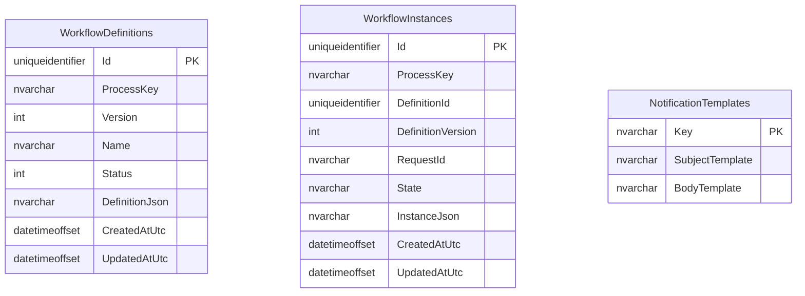

# Database Schema

Database name: `WorkflowEngine`  
Provider: SQL Server

## Entity model (MVP)

## Indexes and constraints

- `WorkflowDefinitions`
  - PK: `Id`
  - Unique index: `(ProcessKey, Version)`
- `WorkflowInstances`
  - PK: `Id`
  - Index: `RequestId`
- `NotificationTemplates`
  - PK: `Key`

## Storage strategy

- Definition data is stored as JSON (`DefinitionJson`) to keep definition flexibility.
- Runtime snapshot is stored as JSON (`InstanceJson`) for MVP speed.
- This model optimizes fast iteration and easy schema evolution.

## Migration history

Current migration: `InitialCreate`  
History table: `__EFMigrationsHistory`

## Operational notes

- For production-scale querying and reporting, runtime JSON can be normalized into dedicated step/assignment tables.
- Current schema is intentionally MVP-friendly and supports rapid workflow model updates.
